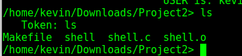
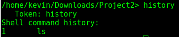
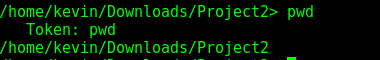
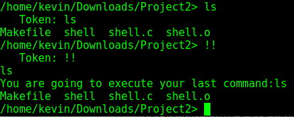
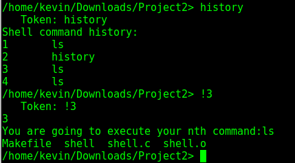

# Nebula Cyber Shell
### A shell built in C. Proof of concept for a custom made shell with custom build in commands(NOT A SECURE PROGRAM and KNOWN BUGS EXIST)

## Table of Contents
   * [KnapSackChat](#nebula-cyber-shell)
      * [Table of Contents](#table-of-contents)
      * [Shell Start](#step-1-sshell-start)
      * [Command List](#command-list)
      * [History](#history)
      * [pwd](#pwd)
      * [!!](#!!)
      * [!n](#!n)

  
      
# Step 1: Shell Start
start the shell by running make in the directory with the shell.c program. This will build the shell executable for you. Then run the shell and you should get a output similiar to the one below.

# Command List
The shell should be able to relay any commands your present shall has built in. However there are some built in commands particular to this shell. Below is an example of ls being run relayed from the shell underneath.

  # history
  You can run a history command
   
  
  # pwd
  You can run the print working directory command
   
  
  # !!
  You can use !! to rerun the last command used(KNOWN BUG EXISTS WHERE IF YOU RUN WITHOUT A HISTORY PROGRAM WILL SEG FAULT)
   
  
  # !n
  You can do !n n being a number and then rerun that command in the history
   
  
