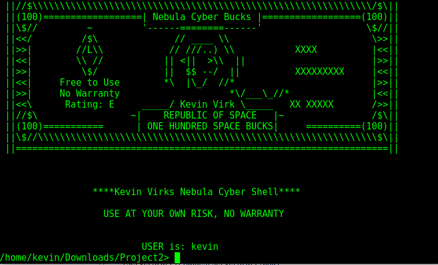

# # Nebula Cyber Shell
### A shell built in C. Proof of concept for a custom made shell with custom build in commands(NOT A SECURE PROGRAM and KNOWN BUGS EXIST)

## Table of Contents
   * [KnapSackChat](#nebula-cyber-shell)
      * [Table of Contents](#table-of-contents)
      * [Shell Start](#step-1-start-shell)
      * [Command List](#command-list)
      * [History](#history)
      * [pwd](#pwd)
      * [!!](#!!)
      * [!n](#!n)

  
      
# Step 1: Shell Start
start the shell by running make in the directory with the shell.c program. This will build the shell executable for you

# Command List

  # history
  # pwd
  # !!
  # !n
